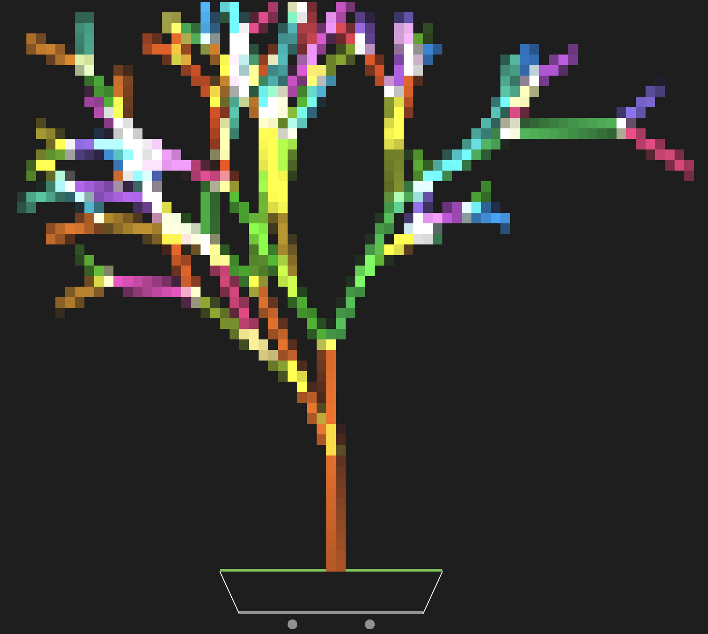

[](https://pkg.go.dev/fortio.org/tbonsai)
[](https://goreportcard.com/report/fortio.org/tbonsai)
[](https://github.com/fortio/tbonsai/releases/)
[](https://github.com/fortio/tbonsai/actions/workflows/include.yml)
[](https://codecov.io/github/fortio/tbonsai)

# tbonsai

Ansipixels port of cbonsai

WIP - current state:



Which is progress from earlier:

```
            ▁▁▁▁▁▁▁▁▁▁▁▁▁▁▁▁▁▁▁▁▁▁▁▁▁▁▁▁▁▁▁▁▁▁▁▁▁▁▁▁▁▁▁▁▁▁▁▁▁▁▁▁▁▁▁
            ╲                                                     ╱
             ╲▁▁▁▁▁▁▁▁▁▁▁▁▁▁▁▁▁▁▁▁▁▁▁▁▁▁▁▁▁▁▁▁▁▁▁▁▁▁▁▁▁▁▁▁▁▁▁▁▁▁▁╱
                  ⚪                                       ⚪
```

## Install
You can get the binary from [releases](https://github.com/fortio/tbonsai/releases)

Or just run
```
CGO_ENABLED=0 go install fortio.org/tbonsai@latest  # to install (in ~/go/bin typically) or just
CGO_ENABLED=0 go run fortio.org/tbonsai@latest  # to run without install
```

or
```
brew install fortio/tap/tbonsai
```

or
```
docker run -ti fortio/tbonsai
```


## Usage

```
tbonsai help

flags:
```
